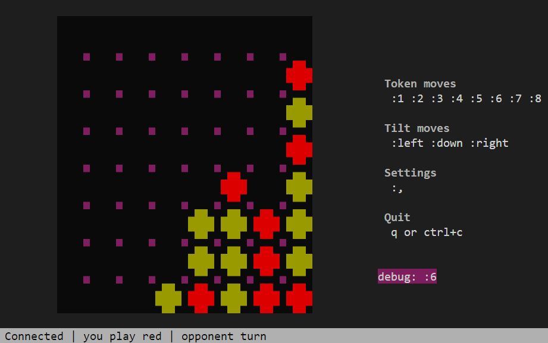

# G4 (gravity-4)

G4 is an open-source board game inspired by the popular game of connect-4.



## Essentials

- G4 plays inside a terminal. The game is developed using the excellent [bubbletea library](https://github.com/charmbracelet/bubbletea) in Go, which means there is no graphical interface. Everything must run in (a modern) terminal. Beware of Windows' terminal, which is missing a few features (see ["known issues"](#known-issues)).

- G4 is a peer-to-peer game. It means there is no server between you and the other player. To be able to play with someone, you need to know their IP address and the port they are using to connect.
> Example:
>
> My opponent's IP address is `a.b.c.d` and they are listening on port `1234`. I, myself, will use my local port `5678`.
> In order to connect with my opponent, I have to use the following channel spec:
>
> `5678:a.b.c.d:1234`
>
> The full `g4` command-line will be `g4 5678:a.b.c.d:1234`.

- G4 is not exactly identical to connect-4.
  1. It uses a bigger, 8x8 board.
  2. It features all the regular connect-4 rules, but adds "tilt moves". A tilt move is a move which rotates the board 90 degrees left, 90 degrees right or even upside-down. It leads to the tokens changing positions because of gravity.
  3. Because of tilt moves, the same position can appear multiple times. To avoid infinite games, there is a 3-fold repetition draw rule. It means that, similar to chess, when the same position appears for the third time, the game is declared a draw.

## State of repository

The repository is currently in an early stage of development. Bugs are likely to be present. On top of that, the code can change drastically without notice. There is no backward-compatibility guarantee. Do not expect to find a finished game at the moment. Some known problems can be found in the section ["known issues"](#known-issues) below.

However, if you find some other bugs or if you have questions, do not hesitate to [open an issue on Github](https://github.com/p-nordmann/g4/issues).

## How to install

At the moment, there is no release available. This means you have to install the game from source.

1. Install Go v1.17 or later. Installation instructions can be found at https://go.dev/doc/install. Once you are done with those instructions, I suggest you set `GOPATH` environment variable and add `$GOPATH/bin` to your `PATH`. If not done, you could have trouble installing or running go programs.
For instance on linux:
```
export GOPATH=$(go env GOPATH)
export PATH=$PATH:$GOPATH/bin
```

2. Install G4 from source. You will need to clone the repository and use the `go install` command.
```
git clone https://github.com/p-nordmann/g4.git
cd g4
go install ./cmd/g4
```

3. Have fun! You should now be able to run `g4` command. :)


## Known issues

- On Windows, the game does not resize properly with the terminal. This is a known limitation of the underlying technology. Unfortunately, Windows does not propagate the resize events to the process. Some workaround can be found, but are not a priority at the moment.
- No 3-fold repetition draws. Right now, the 3-fold repetition rule is not implemented. Coming soon!

## License

This code is distributed under the GNU General Public License v3.0. See [COPYING](COPYING) file for detailed information.
